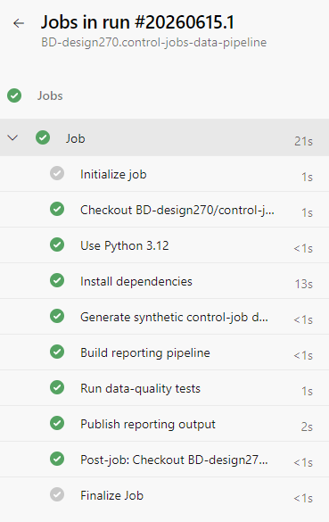
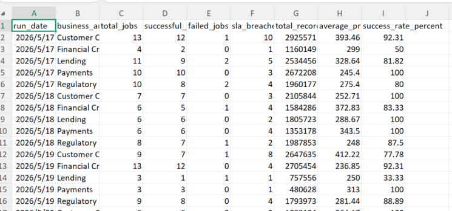

# Control Jobs Data Pipeline

[](PASTE-YOUR-PIPELINE-LINK-HERE)

## Project Overview

A synthetic data pipeline that generates and processes 1,200 control-job records. It demonstrates SQL transformation, data-quality monitoring, reporting and automated CI/CD.

## Architecture

```text
Synthetic CSV
    ↓
Raw SQLite Table
    ↓
Clean SQL View
    ↓
Daily Summary Table
    ↓
Data-Quality Tests
    ↓
Pipeline Artifact
```

Technologies
Python and Pandas
SQL and SQLite
Pytest
GitHub
Azure DevOps Pipelines
Data Model
The source data includes job IDs, control IDs, business areas, run dates, statuses, processing times and failure reasons.
Pipeline Workflow
Generate synthetic control-job data.
Load the data into SQLite.
Apply SQL transformations through a view.
Build a daily summary table.
Export the results as CSV.
Run automated tests.
Data Quality Tests
Tests validate:
At least 1,000 records are loaded
Job IDs are unique
Control IDs are populated
Status values are valid
Failed jobs have failure reasons
Success rates are between 0% and 100%

Example Output
```text
The pipeline creates: output/control_job_daily_summary.csv
```
The report summarises total jobs, successful jobs, failures, SLA breaches and success rates by date and business area.

How to Run Locally
```text
python -m pip install -r requirements.txt
python src/generate_data.py
python src/run_pipeline.py
python -m pytest tests -v
```
Azure DevOps CI/CD
Every push to main automatically generates the data, builds the reporting pipeline, runs the tests and publishes the summary CSV as a pipeline artifact.
Disclaimer
This project uses fully synthetic data. It contains no employer data, proprietary code or confidential business logic.

### Successful Pipeline Run



### Reporting Output




